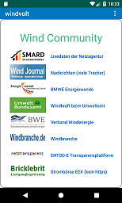

windvolt für Deutschland, 2020 Max Sumer

windvolt targets the usage and pricing of renewable energy

windvolt does not collect any data at this time
windvolt does not monetize

#what's new in v2021
* news page
* online-models

## getting started

* choose any location
* configure settings

## what's contained

* daily recommendation
* news

* the story of windvolt

* who is who diagram
* wind economy diagram

* community links

* device library

    <table>
        <tr>
            <td>
            
            </td>
            <td>
            
            </td>
            <td>
            
            </td>
        </tr>
    </table>

    <table>
        <tr>
            <td>
            
            </td>
            <td>
            
            </td>
            <td>
            
            </td>
        </tr>
    </table>

### code and license

This program is free software: you can redistribute it and/or modify
it under the terms of the GNU General Public License as published by
the Free Software Foundation, either version 3 of the License, or
(at your option) any later version.

This program is distributed in the hope that it will be useful,
but WITHOUT ANY WARRANTY; without even the implied warranty of
MERCHANTABILITY or FITNESS FOR A PARTICULAR PURPOSE.  See the
GNU General Public License for more details.

You should have received a copy of the GNU General Public License
along with this program.  If not, see (http://www.gnu.org/licenses/).
